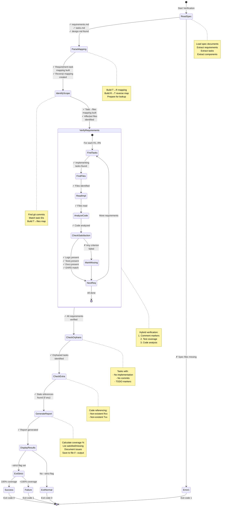

# Spec Implementation Verifier

Verify that implementation satisfies all tasks and requirements from the specification. Run after implementation is complete to validate coverage.

## Input

**Arguments**:
- `spec-dir`: Spec directory path (must contain requirements.md, tasks.md)
- `--strict`: Fail on any missing requirement (exit code 1)
- `--output=path`: Save verification report to file (default: display only)

**Example**:
```bash
/spec-verify docs/bugs/b006-fix-login-timeout/
/spec-verify --strict
/spec-verify --output=verification-report.md
```

## Workflow



## Operations

### 1. Read Specification Documents

**Load from spec directory**:
- `requirements.md` - Extract all requirements (R1, R2, ..., RN)
- `tasks.md` - Extract all tasks (T1, T2, ..., TN) with requirement mappings
- `design.md` - Extract components for reference

**Parse requirement-task mapping**:
```
T1 → R1, R3
T2 → R2, R4
T3 → R1, R5
```

**Build reverse mapping** (requirements → tasks):
```
R1 → T1, T3
R2 → T2
R3 → T1
R4 → T2
R5 → T3
```

### 2. Identify Implementation Scope

**For each task, determine affected files**:
- Read task description for file mentions
- Check design.md for component → file mappings
- Look for git commits matching task IDs (e.g., "feat: implement T1")

**Build task → files mapping**:
```
T1 → auth/handler.go, auth/config.go
T2 → session/manager.go
T3 → auth/timeout.go, middleware/auth.go
```

### 3. Verify Each Requirement

**For each requirement (R1, R2, ..., RN)**:

#### Step A: Find implementing tasks
```
R1 → T1, T3 (from task mapping)
```

#### Step B: Find implementing files
```
R1 → T1 → auth/handler.go, auth/config.go
     T3 → auth/timeout.go, middleware/auth.go
```

**Deduplicated file list**:
```
R1 → auth/handler.go, auth/config.go, auth/timeout.go, middleware/auth.go
```

#### Step C: Read implementation files

**Use Read tool** to examine each file:
- Search for requirement mentions in comments: `// Satisfies R1`
- Search for task mentions: `// Implements T1`
- Analyze last 10 commit messages for references to the requirement/task intent
- Analyze code to verify requirement behavior

#### Step D: Verify requirement satisfaction

**Check implementation matches requirement**:
- Read requirement statement from requirements.md
- Hypothesize what should be true to conclude the requirement is satisfied (e.g., "R1 requires email validation logic in auth/handler.go")
- Analyze implementing code for compliance
- Check for:
  - **Logic presence**: Code implements required behavior
  - **Test coverage**: Tests verify requirement (search for R1 in test files)
  - **Documentation**: Comments/docs mention requirement
  - **EARS pattern match**: Implementation follows requirement pattern

**Example verification**:
```
Requirement R1: "The system SHALL validate email format before storage"
Pattern: Ubiquitous

Files: auth/handler.go
Code found:
  func validateEmail(email string) bool {
    // Satisfies R1: Email validation
    return emailRegex.MatchString(email)
  }

Tests found: auth/handler_test.go
  func TestEmailValidation(t *testing.T) {
    // Verifies R1
    ...
  }

Status: ✅ SATISFIED
- Logic: Present (validateEmail function)
- Tests: Present (TestEmailValidation)
- Documentation: Present (comment references R1)
- Commits: Present (last 10 commits reference R1)
```

### 4. Check for Orphaned Tasks

**Find tasks with no implementation**:
- Tasks mentioned in tasks.md but no code found
- Tasks with no commits
- Tasks with TODO markers still present

**Report**:
```
⚠️  Orphaned Tasks:
- T5: No implementation found (expected files: config/loader.go)
- T8: TODO markers still present in code
```

### 5. Check for Extra Implementation

**Find code that references non-existent requirements**:
- Search codebase for `// Satisfies R99` where R99 doesn't exist
- Find task references (T99) not in tasks.md

**Report**:
```
⚠️  Stale References:
- auth/handler.go:42: References R99 (not in requirements.md)
- session/manager.go:15: References T12 (not in tasks.md)
```

### 6. Generate Verification Report

**Structure**:
```markdown
# Implementation Verification Report

**Spec**: docs/bugs/b006-fix-login-timeout/
**Generated**: 2026-03-05 15:30:00
**Status**: ✅ PASS | ⚠️  PARTIAL | ❌ FAIL

## Summary

- **Requirements**: 8 total, 7 satisfied, 1 missing
- **Tasks**: 12 total, 11 implemented, 1 orphaned
- **Coverage**: 87.5%

## Requirements Verification

### ✅ R1: Validate email format
**Pattern**: Ubiquitous
**Statement**: The system SHALL validate email format before storage.

**Implementation**:
- Files: auth/handler.go (validateEmail)
- Tests: auth/handler_test.go (TestEmailValidation)
- Tasks: T1, T3
- Status: SATISFIED

### ✅ R2: Session timeout handling
**Pattern**: Event-Driven
**Statement**: WHEN session timeout occurs, the system SHALL log user out.

**Implementation**:
- Files: session/manager.go (handleTimeout), middleware/auth.go
- Tests: session/manager_test.go (TestTimeoutHandling)
- Tasks: T2
- Status: SATISFIED

### ❌ R5: Configurable timeout
**Pattern**: Optional
**Statement**: WHERE timeout is configurable, the system SHALL read timeout from config.

**Implementation**:
- Files: NONE FOUND
- Tests: NONE FOUND
- Tasks: T5 (orphaned - no implementation)
- Status: MISSING

## Task Implementation Status

| Task | Requirements | Files | Status |
|------|--------------|-------|--------|
| T1 | R1, R3 | auth/handler.go, auth/config.go | ✅ Complete |
| T2 | R2, R4 | session/manager.go | ✅ Complete |
| T3 | R1, R5 | auth/timeout.go, middleware/auth.go | ⚠️  Partial (R5 missing) |
| T5 | R5, R6 | config/loader.go | ❌ Not implemented |

## Coverage Analysis

### By Requirement
- R1: 100% (logic + tests + docs)
- R2: 100% (logic + tests + docs)
- R3: 100% (logic + tests)
- R4: 90% (logic + tests, missing docs)
- R5: 0% (MISSING)

### By Component
- auth/: 95% coverage (4/5 requirements)
- session/: 100% coverage (2/2 requirements)
- config/: 0% coverage (0/1 requirements)

## Issues Found

### Missing Requirements
1. **R5**: Configurable timeout - No implementation found
   - Expected in: config/loader.go (per tasks.md T5)
   - Blocking tasks: T5

### Orphaned Tasks
1. **T5**: Config loader implementation
   - Requirements: R5, R6
   - Status: No code found, no commits

### Stale References
1. auth/handler.go:42 - References R99 (not in spec)
2. session/manager.go:15 - Comment mentions T12 (not in tasks.md)

## Recommendations

1. **Implement R5**: Create config/loader.go for configurable timeout
2. **Complete T5**: Follow task description in tasks.md
3. **Clean up stale references**: Remove R99, T12 mentions
4. **Add documentation**: R4 implementation missing requirement comments

## Next Steps

1. Fix missing requirements (R5)
2. Implement orphaned tasks (T5)
3. Clean up stale references
4. Re-run verification: `/spec-verify --strict`
```

### 7. Display Results

**Console output**:
```
Verification Results:

Requirements: 7/8 satisfied (87.5%)
Tasks: 11/12 implemented (91.7%)

✅ Satisfied: R1, R2, R3, R4, R6, R7, R8
❌ Missing: R5

⚠️  Issues:
- R5: No implementation found (T5 orphaned)
- Stale reference: auth/handler.go:42 (R99)

Coverage: 87.5%

Report saved to: docs/bugs/b006-fix-login-timeout/verification-report.md
```

### 8. Exit Code (if --strict)

**Exit codes**:
- `0`: All requirements satisfied (100% coverage)
- `1`: Missing requirements or orphaned tasks (if --strict)
- `0`: Partial coverage (if not --strict)

## Output

- Verification report (stdout or file if --output)
- Coverage percentage
- List of missing requirements
- List of orphaned tasks
- **Exit**: Returns control to main assistant

## Error Handling

**If requirements.md or tasks.md missing**:
- Error: "Spec files not found. Run /spec-requirements and /spec-tasks first."
- Exit code: 1

**If no implementation found (empty repository)**:
- Warning: "No implementation found. Have you started coding yet?"
- Generate report with 0% coverage
- Exit code: 1 (if --strict), 0 otherwise

**If requirement references invalid**:
- List all invalid references in "Stale References" section
- Suggest cleanup
- Don't fail verification (warning only)

## Verification Strategies

### Strategy 1: Comment-Based (Explicit)
**Look for explicit requirement markers**:
```go
// Satisfies R1
func validateEmail(email string) bool { ... }

// Implements T2, addresses R2 and R4
func handleTimeout() { ... }
```

**Pros**: Unambiguous, easy to verify
**Cons**: Requires discipline to add comments

### Strategy 2: Test-Based (Coverage)
**Look for requirement mentions in tests**:
```go
// TestEmailValidation verifies R1
func TestEmailValidation(t *testing.T) { ... }
```

**Check test coverage** for implementing files

**Pros**: Tests prove requirement satisfaction
**Cons**: Not all requirements have dedicated tests

### Strategy 3: Code Analysis (Semantic)
**Analyze code behavior** against requirement statement:
- Read requirement: "SHALL validate email format"
- Find functions: validateEmail, checkEmailFormat
- Verify logic matches requirement

**Pros**: Catches implicit implementations
**Cons**: Requires LLM analysis (slower, less precise)

### Recommended: Hybrid Approach
1. **Primary**: Comment-based (R1, T1 markers)
2. **Secondary**: Test-based (verify in test files)
3. **Fallback**: Code analysis (if no comments/tests found)

## Examples

**Full verification**:
```bash
/spec-verify docs/bugs/b006-fix-login-timeout/
```

**Strict mode** (fail on missing requirements):
```bash
/spec-verify --strict
# Exit code 1 if any requirement missing
```

**Save report to file**:
```bash
/spec-verify --output=verification-report.md
# Report saved, also displayed on console
```

**Verify from current directory** (auto-detect spec):
```bash
cd docs/bugs/b006-fix-login-timeout/
/spec-verify
```

## Integration with CI/CD

**In CI pipeline**:
```yaml
- name: Verify implementation
  run: |
    /spec-verify --strict --output=verification-report.md
  # Fails build if requirements not satisfied
```

**Pre-merge check**:
```bash
git hook: pre-push
/spec-verify --strict || echo "Warning: Incomplete implementation"
```

## Next Actions

After this skill completes:

1. **Review** verification report for missing requirements
2. **Implement** any orphaned tasks (tasks with no code)
3. **Fix** missing requirements (0% coverage items)
4. **Clean up** stale references (invalid R/T mentions)
5. **Re-run** verification until 100% coverage:
   ```bash
   /spec-verify --strict
   ```
6. **Optional**: Attach verification report to PR as proof of completeness

**When verification passes (100%)**:
- Implementation is complete
- All requirements satisfied
- Ready for code review and merge
