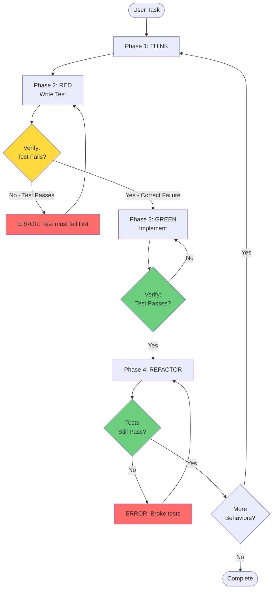

# Test-Driven Development

## Iron Law

**NO IMPLEMENTATION WITHOUT FAILING TEST FIRST**

You MUST verify test failure before writing implementation. A passing test before implementation means the test is broken.

## When to Use This Skill

Use TDD for ALL code changes:

- ✓ Adding new features (any size)
- ✓ Fixing bugs
- ✓ Refactoring existing code
- ✓ Modifying behavior

**Except:**
- Mistakes requiring immediate revert
- Anti-patterns discovered during code review
- "Simple" one-line changes
- "Obvious" fixes
- "Quick" refactors
- "Trivial" updates

**NO OTHER EXCEPTIONS.** User override only.

## The Five Phases



### Phase 1: THINK (Strategy)

Define exactly what behavior you're implementing before writing ANY code.

**Required Output (Structured Template):**
```
Behavior: When [trigger], then [expected outcome]
Scope: [Edge cases IN scope this cycle]
Deferred: [Edge cases NOT in scope - next cycle]
Assertion: [What will be asserted]
Test Name: Test<Function>_<Scenario>[_<Expectation>]
```

**Example Completion:**
```
Behavior: When parseJSON receives invalid input, then returns error
Scope:
  - Malformed JSON strings
  - Error is non-nil
Deferred:
  - Empty strings (next cycle)
  - Valid JSON parsing (future)
Assertion: Error != nil
Test Name: TestParseJSON_InvalidInput_ReturnsError
```

**Activities:**
- Identify ONE specific behavior to implement
- Define clear success criteria
- Define what's in scope vs deferred
- Plan test assertions (what to check, what to ignore)
- Write test name following convention

**Exit criteria:** Can fill all template fields with specific values

---

### Phase 2: RED (Write Failing Test)

Write minimal test that fails for the RIGHT reason.

**<HARD-GATE>**
Do NOT proceed to Phase 3 GREEN until:
1. Test is written
2. Test is executed
3. Test FAILS
4. Failure message matches expected error
**</HARD-GATE>**

**Activities:**
- Write minimal test (< 10 lines typical)
- Single assertion only
- Execute test
- **VERIFY:** Confirm exact failure message
- Document why test fails

**What to write:**
```
Test structure:
1. Setup (arrange)
2. Action (act)
3. Assert (one thing)
```

**What NOT to write:**
- ✗ Multiple assertions
- ✗ Testing multiple behaviors
- ✗ Complex setup logic
- ✗ Implementation code

**Verification checkpoint:**
```
BEFORE GREEN: Confirm test output shows:
✓ Test file compiles (no syntax errors)
✓ Test executed
✓ Test FAILED (not passed, not errored)
✓ Failure type matches expected:
  - Cycle 1 NEW: "undefined: X" or "not declared"
  - Cycle N EXISTING: assertion failure with wrong value
  - TYPE CHANGE: type mismatch error
✓ Compiler/syntax errors resolved
✓ Diagnosis: "If I fix what error says, will test pass?"
```

**Understanding Failure Types:**

**Expected Cycle 1 (New Function):**
```bash
./middleware_test.go:19:13: undefined: ErrorMiddleware
FAIL proj2 [build failed]
```
✓ Correct - Function doesn't exist yet

**Expected Cycle N (Existing Function):**
```bash
--- FAIL: TestErrorMiddleware_AppError (0.00s)
    middleware_test.go:25: expected status 503, got 200
FAIL
```
✓ Correct - Implementation exists but logic is wrong

**Unexpected (Broken Test):**
```bash
./middleware_test.go:25: syntax error: unexpected newline
FAIL proj2 [build failed]
```
✗ Wrong - Fix test syntax, don't proceed

**Special Case (Silent Pass):**
If test passes before implementation:
- Valid IF previous GREEN was sufficient for new test
- Proves GREEN was "just right" level
- Otherwise: STOP, test is broken

**If test passes:** STOP. Test is broken. Fix test, not implementation.

**Exit criteria:** Test fails with expected error message and correct failure type

---

### Phase 3: GREEN (Minimal Implementation)

Write simplest code to pass test. Nothing more.

**<HARD-GATE>**
Entry requirements:
1. Test exists
2. Test is FAILING
3. Failure verified in Phase 2
**</HARD-GATE>**

**Activities:**
- Write minimal code to pass test
- Hardcoding is acceptable
- No refactoring
- No optimization
- Execute tests
- Verify passage

**What minimal means:**
- Hardcode return values if that passes test
- Use simplest logic possible
- Ignore edge cases not in current test
- Copy-paste acceptable
- Bad names acceptable

**The Minimal Spectrum:**

Use this to judge if implementation is minimal enough:

| Implementation | Next Test Impact | Verdict |
|---|---|---|
| Return hardcoded value | Requires rewrite | Too minimal (unless only 1 test) |
| Handle current scenario + defaults | Only assertion change | **Just right ✓** |
| Validate/optimize/handle future cases | No change needed | Over-engineered |

**Example: HTTP Handler**

**TOO MINIMAL (next test needs major rewrite):**
```go
func helloHandler(w http.ResponseWriter, r *http.Request) {
    fmt.Fprintf(w, "Hello, World")  // Doesn't even read param
}
```

**JUST RIGHT ✓ (next test only needs different assertion):**
```go
func helloHandler(w http.ResponseWriter, r *http.Request) {
    name := r.URL.Query().Get("name")
    if name == "" {
        name = "World"
    }
    fmt.Fprintf(w, "Hello, %s", name)
}
```

**OVER-ENGINEERED (adding untested features):**
```go
func helloHandler(w http.ResponseWriter, r *http.Request) {
    name := r.URL.Query().Get("name")
    if name == "" {
        name = "World"
    }
    if len(name) > 100 {  // Validation not in test
        http.Error(w, "name too long", 400)
        return
    }
    fmt.Fprintf(w, "Hello, %s", name)
}
```

**What NOT to do:**
- ✗ Refactor while implementing
- ✗ Optimize prematurely
- ✗ Handle cases not in test
- ✗ Add multiple features
- ✗ Clean up existing code

**Verification checkpoint:**
```
AFTER GREEN: Confirm test output shows:
- All tests executed
- All tests PASSED
- No warnings/errors
```

**Exit criteria:** Implementation at 'just right' level - next test won't require major rewrite

---

### Phase 4: REFACTOR (Improve Design)

Improve structure while keeping tests green.

**<HARD-GATE>**
Entry requirements:
1. All tests PASSING
2. Implementation complete for current behavior
**</HARD-GATE>**

**Activities:**
- Improve structure/naming/duplication
- One refactoring at a time
- Run tests after EACH change
- Revert if tests fail
- Skip if no obvious improvements

**What to refactor:**
- Extract duplicated code
- Improve variable names
- Simplify logic
- Remove hardcoding (if multiple tests exist)
- Improve readability
- Change field types (e.g., string → error) if behavior preserved

**What NOT to refactor:**
- ✗ Multiple changes at once
- ✗ Add new features
- ✗ Change behavior
- ✗ Optimize without measurement

**Example: Type Structure Refactoring**
```go
// BEFORE: Works but not idiomatic
type AppError struct {
    Error         string  // Can't wrap errors
    FriendlyError string
    StatusCode    int
}

// REFACTOR: Better type semantics
type AppError struct {
    Error         error   // Now supports error wrapping
    FriendlyError string
    StatusCode    int
}
```
**Why valid:** Tests still pass (behavior unchanged), structure improved (supports Go error wrapping)

**Verification checkpoint:**
```
AFTER EACH REFACTOR: Confirm:
- All tests still PASSING
- No new warnings
- Behavior unchanged
```

**If tests fail:** STOP. Revert refactoring. Tests define correctness.

**Exit criteria:** Tests pass, code improved (or no improvements needed)

---

### When TDD Feels Slow

TDD can feel slow but still be efficient. Distinguish between productive slowness and wasteful slowness.

**Feels Slow But IS Efficient:**

| Scenario | Why It Feels Slow | Why It's Actually Fast |
|----------|-------------------|------------------------|
| Test takes 5 min, implementation 30 sec | Writing test is work | Saved debugging time later |
| Test setup complex (first test only) | httptest/fixtures/mocks setup | Subsequent tests reuse infrastructure |
| Refactoring takes 10 iterations | Each change triggers test run | Every break caught immediately |
| Test forces you to think harder | Can't just code and see | Prevents implementing wrong thing |

**Actually Slow (Rethink Approach):**

**Red flags:**
- Mocking everything (test longer than feature)
- 100-line setup for 5-line test
- Tests don't catch actual bugs
- Same test logic duplicated 10+ times

**Guidance:**
TDD is working if: `time(test + impl + refactor) < time(impl alone + debugging + manual verification)`

**Remember:** Test setup time amortizes across all future tests. First test in module pays infrastructure cost, rest are cheap.

---

### Phase 5: REPEAT

Return to Phase 1 for next behavior.

**When to repeat:**
- Feature has more behaviors to implement
- Bug has more cases to fix
- Refactoring has more improvements

**When to stop:**
- All required behaviors implemented
- All tests passing
- No obvious improvements remaining

---

## Anti-Skipping Guardrails

**If you think ANY of these, STOP immediately:**

| Thought | Reality |
|---------|---------|
| "This is a simple fix, no TDD required" | Simple fixes need tests too. Return to Phase 1. |
| "The change is obvious" | Obvious changes still need verification. Return to Phase 1. |
| "Just a quick refactor" | Refactoring requires test safety net. Return to Phase 1. |
| "Only renaming variables" | Tests verify no behavior change. Return to Phase 1. |
| "Too small to test" | If too small to break, prove it with test. Return to Phase 1. |
| "I'll write implementation first, then tests" | STOP. Tests first. Return to Phase 2. |
| "Test passes already, that's good" | STOP. Test must fail first. Fix test. |
| "Let me add multiple assertions" | STOP. One assertion per test. Split tests. |
| "I'll refactor while implementing" | STOP. GREEN phase is minimal only. |

**User override only:** TDD can ONLY be skipped with explicit user permission.

---

## Red Flags

These thoughts mean you're breaking TDD:

**During RED phase:**
- "Let me write the implementation to see what test should look like"
- "I'll make the test pass immediately"
- "This test covers multiple scenarios"

**During GREEN phase:**
- "While I'm here, I'll clean up this code"
- "Let me handle these edge cases too"
- "I'll use a better algorithm"

**During REFACTOR phase:**
- "I'll add this feature while refactoring"
- "Let me refactor multiple things at once"
- "Tests might fail but I'll fix them after"

**ALL mean: STOP. Return to appropriate phase.**

---

## Verification Checkpoints

### RED Exit Verification
```
Before GREEN phase:
✓ Test written
✓ Test executed
✓ Test FAILED
✓ Failure message matches expected error
✓ Documented why test fails
```

### GREEN Exit Verification
```
Before REFACTOR phase:
✓ Implementation written
✓ Tests executed
✓ All tests PASSED
✓ No new warnings
✓ Minimal implementation only
```

### REFACTOR Exit Verification
```
After each refactoring:
✓ Tests executed
✓ All tests still PASSED
✓ No behavior change
✓ Code improved
```

---

## Quick Reference

| Phase | Goal | Exit Criteria |
|-------|------|---------------|
| **THINK** | Define behavior | Can articulate test objective |
| **RED** | Write failing test | Test fails with expected error |
| **GREEN** | Minimal implementation | Test passes, minimal code |
| **REFACTOR** | Improve design | Tests pass, code improved |
| **REPEAT** | Next behavior | More work exists |

---

## Examples

See [examples.md](./examples.md) for complete TDD cycle walkthroughs.

---

## Common Mistakes and Anti-Patterns

**Most Critical Red Flags:**

| Anti-Pattern | Impact |
|--------------|--------|
| Implementation before test | Test doesn't verify anything |
| Not verifying test failure | False sense of coverage |
| Multiple assertions per test | Unclear failure messages |
| Over-engineering during GREEN | Premature complexity |
| Refactoring without tests | Silent breakage |

See [anti-patterns.md](./anti-patterns.md) for detailed examples and solutions.

---

## Verification Checklist

Before marking work complete, verify ALL items:

PRE-COMPLETION CHECKLIST:
- [ ] Every new function/method has a test
- [ ] Each test name follows Test<Function>_<Scenario>[_<Expectation>] convention
- [ ] THINK template completed for each cycle
- [ ] Watched each test fail before implementing
- [ ] Each test failed for expected reason (feature missing, not typo)
- [ ] Verified failure TYPE matched expected (undefined vs assertion vs type error)
- [ ] Wrote minimal code to pass each test
- [ ] GREEN implementation at "just right" level (not too minimal, not over-engineered)
- [ ] All tests pass
- [ ] Output pristine (no errors, warnings)
- [ ] Tests use real code (mocks only at boundaries)
- [ ] Performance feels slow but IS efficient (test time < debug time saved)
- [ ] Edge cases covered (nil, empty, invalid input)
- [ ] Error cases covered (failures, exceptions)
- [ ] No test-only methods in production code
- [ ] No testing mock behavior instead of real behavior
- [ ] No multiple behaviors in single test

**If ANY item unchecked:** Work is NOT complete. Return to appropriate phase.

---

## Language-Specific Notes

**Infer from codebase:**
- Test framework (Go: testing / testify, Python: pytest, etc)
- Test file naming (`*_test.go`, `test_*.py`, etc)
- Assertion style (table-driven, BDD, etc)

**When in doubt:** Ask user for test framework preference.

## Integration with Other Workflows

**TDD composes with:**
- Feature development (use TDD for each feature slice)
- Bug fixing (use TDD to reproduce, then fix)
- Refactoring (use tests as safety net)
- Code review (verify tests exist and follow TDD)

**TDD does NOT replace:**
- Integration tests (TDD focuses on unit tests)
- Manual testing (TDD verifies logic, not UX)
- System design (TDD implements design, doesn't create it)

---

## Summary

**The Workflow:**
1. **THINK:** What behavior am I implementing?
2. **RED:** Write test that fails
3. **GREEN:** Write minimal code to pass
4. **REFACTOR:** Improve code structure
5. **REPEAT:** Next behavior

**The Gates:**
- No GREEN without failing test
- No REFACTOR without passing tests
- No skipping phases

**The Discipline:**
- All code changes use TDD
- One behavior per cycle
- Minimal implementation in GREEN
- Verify at every checkpoint

**The Result:**
- Fast feedback cycles
- High test coverage
- Confident refactoring
- Clear regression detection
