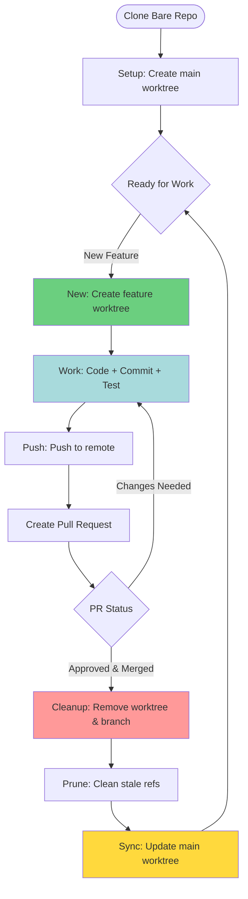

# Git Worktree Workflow

Automates the complete git worktree development lifecycle for worktree-based repositories.

## Workflow Lifecycle



## When to Use This Skill

**CRITICAL**: This skill is ONLY for repositories using git worktrees. It will auto-detect and guide you.

**Use this skill when:**
- Creating new feature branches in worktree repos
- Cleaning up after PR merge
- Syncing main worktree with latest changes
- Checking worktree status

**Worktree Detection:**
A repository uses worktrees if:
- `.git` is a **file** (not a directory)
- File contains `gitdir:` pointing to bare repository
- `git worktree list` shows multiple worktrees

## Operations

### 1. New Feature (`/worktree new [branch-name]`)

Creates a new worktree with its own branch for feature development.

**What it does:**
1. Detects if current repo uses worktrees (REQUIRED)
2. Prompts for branch name if not provided
3. Validates branch naming (suggests conventional format)
4. Determines parent directory (where other worktrees live)
5. Creates worktree directory (replaces `/` with `-` in name)
6. Creates new branch from current branch (usually main)
7. Switches to new worktree directory
8. Confirms setup successful

**Example Flow:**
```bash
# User in: ~/dev/github.com/wizact/myrepo/projects/main
# Invokes: /worktree new feat/user-auth

# Skill executes:
# 1. Checks: [ -f .git ] → Yes, worktree repo ✓
# 2. Branch name: feat/user-auth
# 3. Worktree path: ../feat-user-auth
# 4. Creates: git worktree add ../feat-user-auth feat/user-auth
# 5. Switches: cd ../feat-user-auth
# 6. Confirms: "Now in worktree 'feat-user-auth' on branch 'feat/user-auth'"
```

**Branch Naming Conventions:**
- `feat/description` - New features
- `fix/description` - Bug fixes
- `docs/description` - Documentation
- `refactor/description` - Code refactoring
- `test/description` - Test additions
- `chore/description` - Maintenance

**Safety Checks:**
- ✓ Verifies repo uses worktrees
- ✓ Checks if branch already exists
- ✓ Validates parent directory exists
- ✓ Prevents duplicate worktree names
- ✓ Confirms base branch is clean

**Exit State:**
- Working directory: New worktree path
- Current branch: New feature branch
- Git status: Clean, ready for work

---

### 2. Cleanup (`/worktree cleanup [branch-name]`)

Removes worktree and branch after PR is merged.

**What it does:**
1. Identifies current or specified worktree/branch
2. Confirms worktree is not main/default branch
3. Checks git status (warns if uncommitted changes)
4. Switches to main worktree
5. Removes worktree directory
6. Deletes local branch
7. Runs `git worktree prune` to clean references
8. Optionally deletes remote branch (asks first)

**Example Flow:**
```bash
# User in: ~/dev/github.com/wizact/myrepo/projects/feat-user-auth
# Invokes: /worktree cleanup

# Skill executes:
# 1. Detects current worktree: feat-user-auth
# 2. Checks status: git status (warns if dirty)
# 3. Switches: cd ../main
# 4. Removes worktree: git worktree remove ../feat-user-auth
# 5. Deletes branch: git branch -d feat/user-auth
# 6. Prunes: git worktree prune
# 7. Asks: "Delete remote branch origin/feat/user-auth? (y/n)"
# 8. If yes: git push origin --delete feat/user-auth
# 9. Confirms: "Cleaned up feat/user-auth, now in main worktree"
```

**Safety Checks:**
- ✓ Cannot cleanup main/default branch
- ✓ Warns if uncommitted changes exist
- ✓ Confirms before deleting remote branch
- ✓ Verifies worktree exists before removal
- ✓ Only deletes local branch if fully merged

**Common Scenarios:**

**After PR Merged (Remote Deleted):**
```bash
/worktree cleanup feat/user-auth
# Removes local worktree + branch only
```

**After PR Merged (Remote Still Exists):**
```bash
/worktree cleanup feat/user-auth
# Prompts: "Delete remote branch? (y/n)"
# User confirms, deletes both local and remote
```

**Unmerged Work (Safety):**
```bash
/worktree cleanup feat/experimental
# Warns: "Branch not fully merged. Use -D to force delete? (y/n)"
# Requires explicit confirmation
```

**Exit State:**
- Working directory: Main worktree
- Worktree removed: Yes
- Local branch deleted: Yes
- Remote branch: User choice

---

### 3. Sync Main (`/worktree sync`)

Updates main worktree with latest changes from remote.

**What it does:**
1. Detects main/default worktree location
2. Switches to main worktree
3. Checks git status (warns if dirty)
4. Pulls latest changes from remote
5. Shows summary of changes
6. Lists active worktrees (may need rebasing)

**Example Flow:**
```bash
# User in: ~/dev/github.com/wizact/myrepo/projects/feat-user-auth
# Invokes: /worktree sync

# Skill executes:
# 1. Finds main: git worktree list | grep main
# 2. Switches: cd ../main
# 3. Status: git status (clean)
# 4. Pulls: git pull origin main
# 5. Shows: "Pulled 3 commits, 12 files changed"
# 6. Lists active worktrees:
#    - feat-user-auth (may need rebase)
#    - fix-login-bug (may need rebase)
# 7. Suggests: "Consider rebasing feature branches"
```

**Safety Checks:**
- ✓ Verifies main worktree is clean
- ✓ Confirms on correct branch
- ✓ Checks for conflicts
- ✓ Lists worktrees needing rebase

**Common Scenarios:**

**Normal Sync:**
```bash
/worktree sync
# Fast-forward pull, no conflicts
```

**Dirty Main Worktree:**
```bash
/worktree sync
# Warns: "Main worktree has uncommitted changes"
# Options: stash, commit, abort
```

**After Sync, Rebase Feature Branches:**
```bash
# After sync, switch to feature worktree
cd ../feat-user-auth
git rebase main
```

**Exit State:**
- Working directory: Main worktree
- Branch: Up-to-date with remote
- Indicates if feature branches need rebase

---

### 4. Status (`/worktree status`)

Shows overview of all worktrees and current position in workflow.

**What it does:**
1. Runs `git worktree list` to show all worktrees
2. Highlights current worktree
3. Shows branch status for each worktree
4. Indicates workflow stage (working, ready for PR, needs cleanup)
5. Displays helpful next steps

**Example Output:**
```
Git Worktree Status
===================

Worktrees:
  /path/to/bare/repo/projects/main                     [main]              ✓ clean, up-to-date
→ /path/to/bare/repo/projects/feat-user-auth           [feat/user-auth]    * working (2 commits ahead)
  /path/to/bare/repo/projects/fix-login-bug            [fix/login-bug]     ⚠ needs push (1 commit ahead)
  /path/to/bare/repo/projects/docs-api                 [docs/api]          ✓ PR merged, needs cleanup

Current Worktree: feat-user-auth
Current Stage: Working on feature
Branch Status: 2 commits ahead of origin/feat/user-auth

Next Steps:
- Continue working and commit changes
- When ready: git push origin feat/user-auth
- After push: Create pull request
- After PR merged: /worktree cleanup
```

**Status Indicators:**
- `✓` - Clean, synced with remote
- `*` - Active work in progress
- `⚠` - Needs attention (push, pull, conflicts)
- `→` - Current worktree
- `!` - Uncommitted changes

**Exit State:**
- No changes to working directory
- Informational only

---

## Worktree Repository Structure

**Standard Layout:**
```
parent-folder/
├── bare/                          # Bare repository
│   ├── worktrees/
│   │   ├── main/
│   │   └── feat-user-auth/
│   └── ...
└── projects/                      # Worktrees directory
    ├── main/                      # main branch worktree
    └── feat-user-auth/            # feat/user-auth branch worktree
```

**Alternative Layout (Single Projects Folder):**
```
myrepo/
├── .git/                          # Bare-like structure
│   └── worktrees/
│       ├── main/
│       └── feat-user-auth/
└── projects/
    ├── main/
    └── feat-user-auth/
```

---

## Complete Workflow Example

### Initial Setup (Manual - Done Once)
```bash
# Clone as bare repository
git clone --bare git@github.com:user/repo.git bare

# Create projects folder
mkdir -p projects

# Create main worktree
cd bare
git worktree add ../projects/main main
```

### Development Cycle (Using Skill)

**1. Start New Feature**
```bash
cd projects/main
/worktree new feat/user-authentication

# Now in: projects/feat-user-authentication
# On branch: feat/user-authentication
```

**2. Work on Feature**
```bash
# Make changes...
git add .
git commit -S -m "feat(auth): add user login endpoint"
git commit -S -m "feat(auth): add JWT token generation"
```

**3. Push and Create PR**
```bash
git push -u origin feat/user-authentication

# Create PR via GitHub CLI or Web UI
gh pr create --title "Add user authentication" --body "..."
```

**4. After PR Merged**
```bash
/worktree cleanup feat/user-authentication

# Prompts: "Delete remote branch? (y/n)" → y
# Result: Worktree removed, branch deleted, back in main
```

**5. Sync Main with Latest**
```bash
/worktree sync

# Pulls latest merged changes
# Ready for next feature
```

**6. Check Status Anytime**
```bash
/worktree status

# Shows all worktrees, current position, next steps
```

---

## Best Practices

### Do:
- **One feature, one worktree** - Keep work isolated
- **Descriptive branch names** - Use conventional format
- **Clean up after merge** - Prevent stale worktrees
- **Sync main regularly** - Stay up-to-date with team
- **Check status often** - Know where you are in workflow

### Don't:
- **Don't use `git checkout -b`** - Always use `/worktree new`
- **Don't manually delete worktree folders** - Use `/worktree cleanup`
- **Don't share worktrees** - One branch per worktree
- **Don't forget to sync** - Pull latest before new features
- **Don't leave stale worktrees** - Clean up merged branches

---

## Troubleshooting

### "fatal: 'branch-name' is already checked out"
**Cause:** Branch already has a worktree.

**Fix:**
```bash
/worktree status  # Find existing worktree
cd ../existing-worktree  # Switch to it, OR
/worktree cleanup branch-name  # Remove it
```

### "Worktree has uncommitted changes"
**Cause:** Trying to cleanup dirty worktree.

**Fix:**
```bash
# Option 1: Commit changes
git add . && git commit -S -m "wip: save work"

# Option 2: Stash changes
git stash

# Option 3: Discard changes (careful!)
git reset --hard
```

### "Branch not fully merged"
**Cause:** Branch has commits not in main.

**Fix:**
```bash
# Verify branch status
git log main..feat/branch-name

# If work is valuable, don't delete
# If work is abandoned, force delete with confirmation
/worktree cleanup feat/branch-name  # Skill will prompt for -D
```

### "Cannot find main worktree"
**Cause:** Main/default branch worktree doesn't exist.

**Fix:**
```bash
# Manually create main worktree
git worktree add ../main main
```

---

## Integration with Other Workflows

### With Pull Requests
```bash
# Create feature
/worktree new feat/api-endpoint

# Work and push
# ... commits ...
git push -u origin feat/api-endpoint

# Create PR (using gh CLI or Web)
gh pr create

# After PR approved and merged
/worktree cleanup feat/api-endpoint
/worktree sync
```

### With Multiple Features
```bash
# Feature 1
/worktree new feat/frontend-ui
# ... work in parallel ...

# Feature 2
/worktree new feat/backend-api
# ... work in parallel ...

# Check all active work
/worktree status

# Cleanup as PRs merge
/worktree cleanup feat/frontend-ui
/worktree cleanup feat/backend-api
```

### With Signed Commits
```bash
# After /worktree new, commits should be signed
git commit -S -m "feat: add feature"

# Skill respects git-workflow.md requirements
```

---

## Command Reference

| Command | Purpose | Example |
|---------|---------|---------|
| `/worktree new [name]` | Create feature worktree | `/worktree new feat/login` |
| `/worktree cleanup [name]` | Remove worktree after merge | `/worktree cleanup feat/login` |
| `/worktree sync` | Update main worktree | `/worktree sync` |
| `/worktree status` | Show all worktrees | `/worktree status` |

---

## Detection Logic

**How skill detects worktree repository:**

```bash
# Check 1: Is .git a file?
if [ -f .git ]; then
    # Check 2: Does it contain gitdir?
    if grep -q "gitdir:" .git; then
        # Worktree repository ✓
        USE_WORKTREE=true
    fi
else
    # Regular repository
    echo "This repository doesn't use worktrees."
    echo "Use standard git workflow instead."
    USE_WORKTREE=false
fi

# Check 3: Verify with git command
if git worktree list | wc -l > 1; then
    # Multiple worktrees confirmed
    USE_WORKTREE=true
fi
```

**If not a worktree repository:**
- Skill displays helpful message
- Suggests using standard git commands instead
- Does NOT attempt worktree operations

---

## Summary

**The Workflow:**
1. **New** - Create feature worktree with branch
2. **Work** - Code, commit, test in isolated worktree
3. **Push** - Push to remote, create PR
4. **Cleanup** - Remove worktree after merge
5. **Sync** - Update main with latest changes
6. **Status** - Check position in workflow anytime

**The Benefits:**
- Isolated feature development
- Easy context switching
- No branch conflicts
- Clean workspace management
- Automated housekeeping

**The Rules:**
- One feature, one worktree
- Always cleanup after merge
- Sync main regularly
- Use skill for all worktree operations
